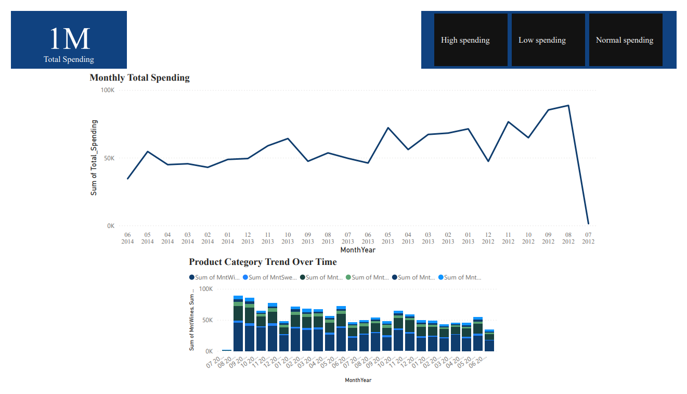

# 📊 Customer Spending & Product Sales Dashboard – Power BI

## 🔹 Overview

This **Power BI Dashboard** analyzes **customer spending behavior** and **product sales trends**, designed with a **Fortune 500 executive-friendly layout**:

- **Total Spending** (USD) and **Monthly Trend**
- **Spending Segmentation** with interactive dropdown filter
- **Top Customers & Products** for deep-dive analysis
- **Product Category Performance** over time

> **Goal:** Provide actionable insights to identify high-value customers and optimize product strategy.

---

## 📑 Dashboard Pages

### **Page 1 – Executive Overview**
- KPI Card: **Total Spending (USD)**  
- Line Chart: **Monthly Total Spending**  
- Line/Area Chart: **Product Category Trend Over Time**  
- Dropdown Slicer: **Spending Segment**

---

### **Page 2 – Deep Dive Analysis**
- Horizontal Bar Chart: **Top 10 Customers by Spending**  
- Horizontal Bar Chart: **Top 5 Products by Quantity Sold**

---

## 💡 Key Insights
1. **Top 10% customers** contribute majority of total spending.  
2. **Seasonal spikes** in spending during holiday months.  
3. **Top 5 products** generate over 60% of total quantity sold.  
4. **High-value customer segments** are concentrated in “Premium” spending tier.

---

## ⚙️ Tech Stack
- **Power BI Desktop** – Data Modeling, DAX, Visualization
- **Excel / CSV** – Data Source
- **GitHub** – Portfolio Hosting

---

---

## 🚀 How to Use
1. Clone this repository  
2. Open `Dashboard_Portfolio.pdf` for quick viewing  
3. (Optional) Download `.pbix` if provided to explore interactively in Power BI  

---

## ✨ Author
Created by Navin – Data Passionate
- 📧 bvy2602@gmail.com  
- 💼 https://www.linkedin.com/in/navin826/  
- 🌐 https://github.com/CallmeNavin
